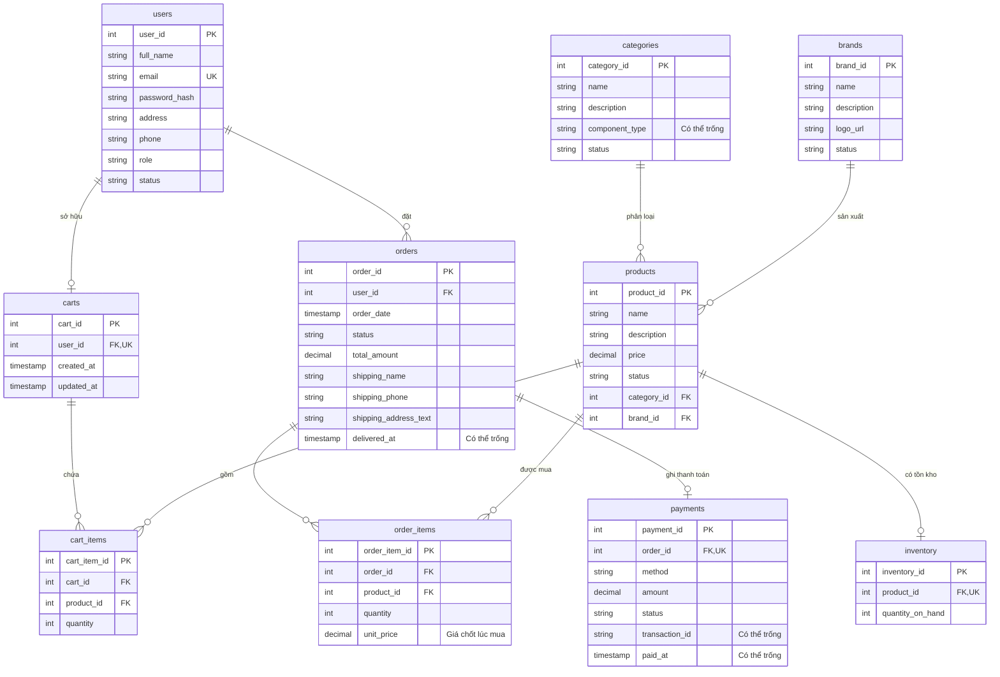

# Mô hình dữ liệu CORE — T03

ERD dưới đây mô tả thiết kế CORE theo `backend/BACKEND_GUIDE.md`. **Hiện chỉ bảng `brands` được triển khai bằng Flyway V1 và ánh xạ JPA.** Các bảng còn lại là kế hoạch cho migration tiếp theo; sơ đồ không có nghĩa chúng đã tồn tại trong database.

## Sơ đồ quan hệ

Sơ đồ thể hiện khả năng lưu trữ của PK/FK: một Product có tối đa một Inventory, một Order có thể chưa có dòng hàng/thanh toán trong lúc tạo. Service phải tạo đầy đủ Inventory khi thêm sản phẩm và ít nhất một OrderItem cùng Payment khi checkout, trong cùng transaction. FK đơn thuần không bắt buộc bản ghi cha phải có bản ghi con.

## Bảng đã triển khai: brands

| Cột | Kiểu PostgreSQL | Ràng buộc |
| --- | --- | --- |
| `brand_id` | `INTEGER` | PK, tự sinh bằng identity |
| `name` | `VARCHAR(120)` | Không được NULL |
| `description` | `TEXT` | Cho phép NULL |
| `logo_url` | `VARCHAR(2048)` | Cho phép NULL |
| `status` | `VARCHAR(20)` | Không NULL, mặc định ACTIVE, CHECK ACTIVE/INACTIVE |

Entity: `com.pcstore.entity.Brand`; enum `ActiveStatus` lưu bằng chuỗi. Tên hãng chưa bị buộc duy nhất vì guide chưa chốt quy tắc đó. Migration và test hiện chỉ sử dụng bảng này.

## Ràng buộc dự kiến cho phần CORE còn lại

- Tên bảng/cột dùng `snake_case`; dùng `users` và `orders` để tránh trùng từ khóa. Tên trong sơ đồ là đề xuất cho migration tiếp theo.
- Email duy nhất; một Cart/User; một Inventory/Product; một Payment/Order; cặp `(cart_id, product_id)` duy nhất.
- Giá dùng Java `BigDecimal` và PostgreSQL `NUMERIC`, không âm. Chốt precision/scale trước migration tương ứng.
- Số lượng CartItem/OrderItem lớn hơn 0; `quantity_on_hand` không âm. CORE trừ tồn khi đặt và hoàn tồn khi hủy hợp lệ, không dùng giữ chỗ bằng `reservedQuantity`.
- OrderItem lưu `unit_price`; Order lưu thông tin người nhận và địa chỉ tại lúc đặt. Các field Promotion bổ sung ở đợt sau.
- Payment hỗ trợ COD/BANK_TRANSFER, trạng thái PENDING/PAID/FAILED. Order dùng PENDING/CONFIRMED/SHIPPING/DELIVERED/CANCELLED.
- Không cascade xóa User/Product vào lịch sử Order. Chốt FK, index và chính sách xóa trong migration từng bảng.
- ProductImage chỉ thêm khi API/UI yêu cầu; PC Builder, Spec và Compatibility thuộc T17. Không tạo Address/AdministrativeArea trong CORE hiện tại.

## Flyway và cách kiểm chứng

V1 nằm ở `backend/src/main/resources/db/migration/V1__create_brands.sql`. `JpaConfig` chạy Flyway trước Hibernate `validate`; Hibernate không tự sửa schema. Flyway ghi lịch sử trong `flyway_schema_history`.

Chạy `mvn -f backend/pom.xml clean verify -Pintegration-tests` với Docker Desktop đang bật để kiểm tra migration, mapping và ghi/đọc bảng `brands` trên PostgreSQL 17 riêng. Xem hướng dẫn và báo cáo tại [README](../README.md).
