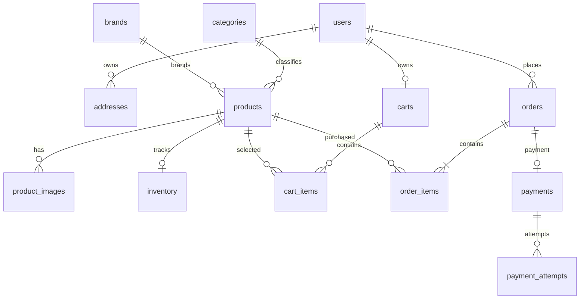
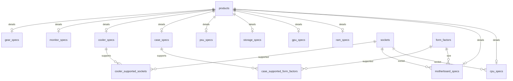
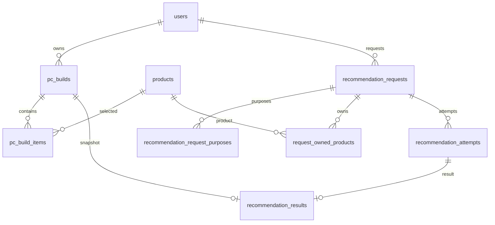
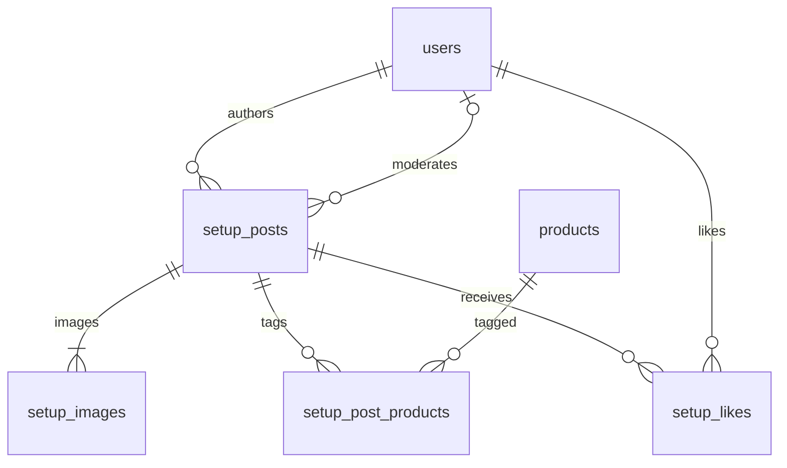
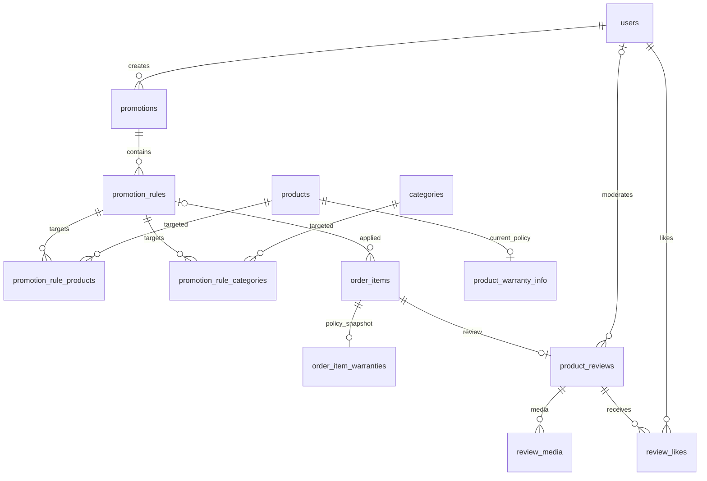

# Mô hình dữ liệu PC Store — thiết kế đã hiệu chỉnh

## 1. Phạm vi và nguồn thiết kế

Tài liệu mô tả mô hình dữ liệu mục tiêu của PC Store, dựa trên `Bản sao của PC-Store-Class-Diagram-One-Page.drawio.xml` và các phương án hiệu chỉnh đã được người dùng yêu cầu áp dụng ngày 01/10/2026. Các quyết định dưới đây thay thế những điểm thiếu/mâu thuẫn của bản mô tả trước; đây không còn là bản chép nguyên sơ đồ. Danh sách thay đổi để đồng bộ lại class diagram nằm ở mục 7.

Phạm vi mô hình gồm tài khoản, địa chỉ, catalog, tồn kho, giỏ hàng, đơn hàng, thanh toán, thông số linh kiện, PC Builder, Recommendation, Community, Promotion, Warranty và Review. Thứ tự triển khai CORE → FEATURE → ADVANCED được tóm tắt trong [mục lục tài liệu](README.md); mô tả đầy đủ ở đây không có nghĩa tất cả đã được triển khai. Backend giữ Java Servlet → Service → DAO → JPA/Hibernate → PostgreSQL.

**Trạng thái:** T03 (01/10/2026) triển khai 12 bảng CORE bằng Flyway V1 + V2 và entity JPA; Hibernate dùng `validate`. T10 (04/10/2026) thêm V3 với 21 bảng cho 8 Spec Builder, PC Builder, Review/Media/Like và Setup. T21 thêm V5–V8 cho `media_assets`, video ngắn và dọn/retry; backend đã có API upload/đọc có kiểm tra quyền cùng service gắn/tháo media cho T26/T29 gọi khi tạo bài. `CoreDatabaseIT` kiểm tra CORE/JPA; `FeatureMigrationIT` kiểm tra V3. Xem [hướng dẫn media T21](../backend/T21_MEDIA.md). File draw.io chưa được chỉnh sửa.

## 2. Quy ước và quyết định chung

| Nội dung | Quyết định |
| --- | --- |
| Tên | Lớp/thuộc tính Java dùng PascalCase/camelCase; bảng/cột SQL dùng snake_case. |
| PK số | INTEGER GENERATED ALWAYS AS IDENTITY; không tự sinh ID ở bảng dùng shared PK hoặc PK ghép. |
| Tiền | Một tiền tệ VND, nguyên đồng; Java BigDecimal → NUMERIC(19,0). Làm tròn HALF_UP một lần ở giá sau giảm của mỗi đơn vị sản phẩm, rồi nhân quantity. |
| Giá trị giảm | NUMERIC(19,2); phần trăm cho phép hai chữ số thập phân, số tiền cố định bắt buộc nguyên đồng. |
| Thời gian | Java LocalDateTime → TIMESTAMP WITHOUT TIME ZONE; toàn ứng dụng diễn giải cùng múi giờ Asia/Bangkok (UTC+07:00). Khoảng hiệu lực là [bắt đầu, kết thúc). Không trộn timestamp theo múi giờ máy chủ khác. |
| Kiểu cơ bản | int → INTEGER, long → BIGINT, boolean → BOOLEAN, double → DOUBLE PRECISION. Số thực phải hữu hạn, không nhận NaN/Infinity. |
| Chuỗi | Độ dài ở mục 4; văn bản dài dùng TEXT. Chuỗi bắt buộc mang nội dung phải trim và không rỗng. Chuỗi tùy chọn không nhập được chuẩn hóa thành NULL. |
| Enum | VARCHAR(32), lưu tên kèm CHECK tập giá trị mục 5; không lưu ordinal. |
| Mặc định | Không có DEFAULT ngầm ngoài các giá trị ghi rõ. Các status kiểu ActiveStatus/UserStatus mặc định ACTIVE; các timestamp nghiệp vụ do Service ghi theo sự kiện. |
| FK | NOT NULL trừ khi ghi NULL. Mỗi FK trỏ đúng PK của bảng đích. Không dùng ID không có FK cho các quan hệ nội bộ. |
| Collection | List/Set được biểu diễn bằng bảng con/bảng nối; không tạo cột CSV hoặc JSON để thay các quan hệ đã thiết kế. |
| Giá trị tính | Không lưu cartTotal, buildTotal, subtotal, likeCount, availableQuantity hoặc WarrantyDisplayStatus. Order.totalAmount và Result.estimatedTotal là các tổng đã chốt được lưu có chủ đích. |

Các CHECK trên một hàng, UNIQUE và FK thực hiện ở database; điều kiện liên bảng hoặc nhiều hàng được Service kiểm tra trong transaction với khóa phù hợp. Không dùng CHECK giả định có thể truy vấn tùy ý sang bảng khác.

## 3. Sơ đồ quan hệ đã sửa

Trong các sơ đồ, `||` = đúng 1, `o|` = 0..1, `o{` = 0..*, `|{` = 1..*. Mỗi dòng con có một cha qua FK NOT NULL, trừ quan hệ được ghi là tùy chọn. ERD thể hiện bội số nghiệp vụ; không tự động bảo đảm cha có đủ con bằng FK.

### 3.1. Tài khoản, catalog và bán hàng

- Một User có 0..* Address; **mỗi Address thuộc đúng một User**. Hai User có thể lưu cùng địa chỉ thực tế bằng hai bản ghi độc lập. Mỗi User có tối đa một địa chỉ mặc định; không bắt buộc luôn có mặc định.
- Mỗi Order có đúng một bản ghi Payment tổng hợp theo dõi tình trạng thanh toán của toàn đơn. Mỗi lần khách hàng mở cổng thanh toán trực tuyến (VNPay) được ghi nhận thành một bản ghi trong `payment_attempts`.
- Product có 0..1 Inventory; trước khi cho phép bán, Service phải có Inventory. Product thiếu Inventory được xem là không khả dụng, không mặc định tồn vô hạn.

### 3.2. Thông số và tương thích

Mỗi Spec dùng product_id làm PK đồng thời là FK. PK ghép của hai bảng tương thích chống trùng cặp linh kiện–chuẩn hỗ trợ. Chỉ một loại Spec trên một Product trong mô hình này; Service khóa Product khi thêm/đổi Spec để kiểm tra loại chéo giữa các bảng. Product nháp được phép chưa có Spec.

### 3.3. PC Builder và Recommendation

Không có FK Request → Result trực tiếp. Truy vết qua Request → Attempt → Result → Build. Một Request chỉ có tối đa một Attempt ACCEPTED nên tối đa một Result được chấp nhận; mỗi Attempt có 0..1 Result. Request nháp có thể chưa có purpose; khi gửi xử lý phải có ít nhất một.

### 3.4. Community

### 3.5. Khuyến mãi, bảo hành và đánh giá

ReviewMedia giới hạn **0..6** bản ghi/review; Mermaid chỉ thể hiện phía nhiều, giới hạn 6 được bảo đảm bằng nghiệp vụ. Quan hệ User–Review trong ERD là **người kiểm duyệt tùy chọn**, không phải tác giả. Tác giả được xác định từ OrderItem → Order → User.

## 4. Từ điển dữ liệu

Mỗi hàng là một cột vật lý. NN = NOT NULL; NULL = tùy chọn; PK = khóa chính; FK = khóa ngoại. Kiểu FK phải trùng kiểu khóa được tham chiếu. Các cột NN không có DEFAULT phải được Service cung cấp. Các collection Java được ánh xạ qua quan hệ trong ERD, không tạo cột danh sách.

### 4.1. Tài khoản và catalog

#### User → `users`

| Thuộc tính Java | Cột | Kiểu PostgreSQL | Ràng buộc |
| --- | --- | --- | --- |
| `userId` | `user_id` | `INTEGER` | PK, NN; GENERATED ALWAYS AS IDENTITY |
| `fullName` | `full_name` | `VARCHAR(255)` | NN |
| `email` | `email` | `VARCHAR(254)` | NN |
| `passwordHash` | `password_hash` | `VARCHAR(255)` | NN |
| `phone` | `phone` | `VARCHAR(32)` | NULL |
| `role` | `role` | `VARCHAR(32)` | NN; CHECK enum UserRole |
| `status` | `status` | `VARCHAR(32)` | NN; CHECK enum UserStatus |

Email được trim và chuyển chữ thường trước khi lưu; CHECK email = lower(btrim(email)), UNIQUE(email). Vai trò mặc định CUSTOMER; trạng thái mặc định ACTIVE. Không trả passwordHash qua API.

#### Address → `addresses`

| Thuộc tính Java | Cột | Kiểu PostgreSQL | Ràng buộc |
| --- | --- | --- | --- |
| `addressId` | `address_id` | `INTEGER` | PK, NN; GENERATED ALWAYS AS IDENTITY |
| `addressDetail` | `address_detail` | `TEXT` | NN |
| `user` | `user_id` | `INTEGER` | NN; FK → users.user_id |
| `isDefault` | `is_default` | `BOOLEAN` | NN; DEFAULT FALSE |

User 1 – 0..* Address; mỗi Address thuộc đúng một User. UNIQUE INDEX trên user_id WHERE is_default = TRUE. Không UNIQUE address_detail: hai User có thể lưu cùng địa chỉ thực tế thành hai bản ghi riêng. setDefault() khóa bản ghi User rồi cập nhật các địa chỉ trong một transaction.

#### Category → `categories`

| Thuộc tính Java | Cột | Kiểu PostgreSQL | Ràng buộc |
| --- | --- | --- | --- |
| `categoryId` | `category_id` | `INTEGER` | PK, NN; GENERATED ALWAYS AS IDENTITY |
| `name` | `name` | `VARCHAR(255)` | NN |
| `description` | `description` | `TEXT` | NULL |
| `componentType` | `component_type` | `VARCHAR(32)` | NULL; CHECK enum ComponentType |
| `status` | `status` | `VARCHAR(32)` | NN; CHECK enum ActiveStatus |

component_type NULL cho nhóm ngoài linh kiện thùng PC (ví dụ màn hình/gear). Tên không mặc định UNIQUE. Không đổi loại danh mục nếu làm Spec hiện hữu không hợp lệ.

#### Brand → `brands`

| Thuộc tính Java | Cột | Kiểu PostgreSQL | Ràng buộc |
| --- | --- | --- | --- |
| `brandId` | `brand_id` | `INTEGER` | PK, NN; GENERATED ALWAYS AS IDENTITY |
| `name` | `name` | `VARCHAR(255)` | NN |
| `description` | `description` | `TEXT` | NULL |
| `logoUrl` | `logo_url` | `VARCHAR(2048)` | NULL |
| `status` | `status` | `VARCHAR(32)` | NN; CHECK enum ActiveStatus |

Tên hãng chưa áp UNIQUE vì không phải định danh. Description/logo cho phép NULL. Đây là schema mục tiêu, không xác nhận migration cũ đã tồn tại.

#### Product → `products`

| Thuộc tính Java | Cột | Kiểu PostgreSQL | Ràng buộc |
| --- | --- | --- | --- |
| `productId` | `product_id` | `INTEGER` | PK, NN; GENERATED ALWAYS AS IDENTITY |
| `name` | `name` | `VARCHAR(255)` | NN |
| `description` | `description` | `TEXT` | NULL |
| `price` | `price` | `NUMERIC(19,0)` | NN |
| `status` | `status` | `VARCHAR(32)` | NN; CHECK enum ProductStatus |
| `category` | `category_id` | `INTEGER` | NN; FK → categories.category_id |
| `brand` | `brand_id` | `INTEGER` | NN; FK → brands.brand_id |

Giá là VND nguyên đồng, CHECK price >= 0. Trạng thái mặc định DRAFT. Mỗi sản phẩm thuộc đúng một Category và một Brand. Điều kiện bán còn phụ thuộc trạng thái danh mục/hãng và tồn khả dụng.

#### ProductImage → `product_images`

| Thuộc tính Java | Cột | Kiểu PostgreSQL | Ràng buộc |
| --- | --- | --- | --- |
| `imageId` | `image_id` | `INTEGER` | PK, NN; GENERATED ALWAYS AS IDENTITY |
| `product` | `product_id` | `INTEGER` | NN; FK → products.product_id |
| `imageUrl` | `image_url` | `VARCHAR(2048)` | NN |
| `isPrimary` | `is_primary` | `BOOLEAN` | NN |
| `sortOrder` | `sort_order` | `INTEGER` | NN |

UNIQUE(product_id, sort_order); CHECK sort_order >= 0. Unique index product_id WHERE is_primary = TRUE giới hạn tối đa một ảnh chính.

#### Inventory → `inventory`

| Thuộc tính Java | Cột | Kiểu PostgreSQL | Ràng buộc |
| --- | --- | --- | --- |
| `inventoryId` | `inventory_id` | `INTEGER` | PK, NN; GENERATED ALWAYS AS IDENTITY |
| `quantityOnHand` | `quantity_on_hand` | `INTEGER` | NN |
| `reservedQuantity` | `reserved_quantity` | `INTEGER` | NN |
| `product` | `product_id` | `INTEGER` | NN; FK → products.product_id; UNIQUE |

UNIQUE(product_id); hai số lượng DEFAULT 0. CHECK quantity_on_hand >= 0 AND reserved_quantity >= 0 AND reserved_quantity <= quantity_on_hand. availableQuantity là giá trị tính, không lưu cột.

### 4.2. Thông số linh kiện

#### Socket → `sockets`

| Thuộc tính Java | Cột | Kiểu PostgreSQL | Ràng buộc |
| --- | --- | --- | --- |
| `socketCode` | `socket_code` | `VARCHAR(32)` | PK, NN |
| `name` | `name` | `VARCHAR(255)` | NN |

#### FormFactor → `form_factors`

| Thuộc tính Java | Cột | Kiểu PostgreSQL | Ràng buộc |
| --- | --- | --- | --- |
| `formFactorCode` | `form_factor_code` | `VARCHAR(32)` | PK, NN |
| `name` | `name` | `VARCHAR(255)` | NN |

#### CpuSpec → `cpu_specs`

| Thuộc tính Java | Cột | Kiểu PostgreSQL | Ràng buộc |
| --- | --- | --- | --- |
| `product` | `product_id` | `INTEGER` | PK, NN; FK → products.product_id |
| `socket` | `socket_code` | `VARCHAR(32)` | NN; FK → sockets.socket_code |
| `cores` | `cores` | `INTEGER` | NN |
| `threads` | `threads` | `INTEGER` | NN |
| `baseClockGhz` | `base_clock_ghz` | `DOUBLE PRECISION` | NN |
| `boostClockGhz` | `boost_clock_ghz` | `DOUBLE PRECISION` | NN |
| `tdpWatts` | `tdp_watts` | `INTEGER` | NN |

product_id là shared PK/FK → products.product_id; không có spec_id riêng. Quy tắc kiểm tra số đo và loại Spec ở mục 6.7.

#### MotherboardSpec → `motherboard_specs`

| Thuộc tính Java | Cột | Kiểu PostgreSQL | Ràng buộc |
| --- | --- | --- | --- |
| `product` | `product_id` | `INTEGER` | PK, NN; FK → products.product_id |
| `socket` | `socket_code` | `VARCHAR(32)` | NN; FK → sockets.socket_code |
| `chipset` | `chipset` | `VARCHAR(255)` | NN |
| `ramType` | `ram_type` | `VARCHAR(255)` | NN |
| `pcieVersion` | `pcie_version` | `VARCHAR(255)` | NN |
| `formFactor` | `form_factor_code` | `VARCHAR(32)` | NN; FK → form_factors.form_factor_code |
| `ramSlots` | `ram_slots` | `INTEGER` | NN |
| `maxRamGb` | `max_ram_gb` | `INTEGER` | NN |

product_id là shared PK/FK → products.product_id; không có spec_id riêng. Quy tắc kiểm tra số đo và loại Spec ở mục 6.7.

#### RamSpec → `ram_specs`

| Thuộc tính Java | Cột | Kiểu PostgreSQL | Ràng buộc |
| --- | --- | --- | --- |
| `product` | `product_id` | `INTEGER` | PK, NN; FK → products.product_id |
| `ramType` | `ram_type` | `VARCHAR(255)` | NN |
| `capacityGb` | `capacity_gb` | `INTEGER` | NN |
| `speedMhz` | `speed_mhz` | `INTEGER` | NN |
| `moduleCount` | `module_count` | `INTEGER` | NN |

product_id là shared PK/FK → products.product_id; không có spec_id riêng. Quy tắc kiểm tra số đo và loại Spec ở mục 6.7.

#### GpuSpec → `gpu_specs`

| Thuộc tính Java | Cột | Kiểu PostgreSQL | Ràng buộc |
| --- | --- | --- | --- |
| `product` | `product_id` | `INTEGER` | PK, NN; FK → products.product_id |
| `vramGb` | `vram_gb` | `INTEGER` | NN |
| `memoryType` | `memory_type` | `VARCHAR(255)` | NN |
| `interfaceType` | `interface_type` | `VARCHAR(255)` | NN |
| `lengthMm` | `length_mm` | `INTEGER` | NN |
| `powerConsumptionW` | `power_consumption_w` | `INTEGER` | NN |
| `recommendedPsuW` | `recommended_psu_w` | `INTEGER` | NN |

product_id là shared PK/FK → products.product_id; không có spec_id riêng. Quy tắc kiểm tra số đo và loại Spec ở mục 6.7.

#### StorageSpec → `storage_specs`

| Thuộc tính Java | Cột | Kiểu PostgreSQL | Ràng buộc |
| --- | --- | --- | --- |
| `product` | `product_id` | `INTEGER` | PK, NN; FK → products.product_id |
| `storageType` | `storage_type` | `VARCHAR(255)` | NN |
| `interfaceType` | `interface_type` | `VARCHAR(255)` | NN |
| `capacityGb` | `capacity_gb` | `INTEGER` | NN |
| `readSpeedMBps` | `read_speed_mbps` | `INTEGER` | NN |
| `writeSpeedMBps` | `write_speed_mbps` | `INTEGER` | NN |

product_id là shared PK/FK → products.product_id; không có spec_id riêng. Quy tắc kiểm tra số đo và loại Spec ở mục 6.7.

#### PsuSpec → `psu_specs`

| Thuộc tính Java | Cột | Kiểu PostgreSQL | Ràng buộc |
| --- | --- | --- | --- |
| `product` | `product_id` | `INTEGER` | PK, NN; FK → products.product_id |
| `wattage` | `wattage` | `INTEGER` | NN |
| `efficiencyRating` | `efficiency_rating` | `VARCHAR(255)` | NN |
| `modularType` | `modular_type` | `VARCHAR(255)` | NN |

product_id là shared PK/FK → products.product_id; không có spec_id riêng. Quy tắc kiểm tra số đo và loại Spec ở mục 6.7.

#### CaseSpec → `case_specs`

| Thuộc tính Java | Cột | Kiểu PostgreSQL | Ràng buộc |
| --- | --- | --- | --- |
| `product` | `product_id` | `INTEGER` | PK, NN; FK → products.product_id |
| `maxGpuLengthMm` | `max_gpu_length_mm` | `INTEGER` | NN |
| `maxCoolerHeightMm` | `max_cooler_height_mm` | `INTEGER` | NN |
| `maxRadiatorSizeMm` | `max_radiator_size_mm` | `INTEGER` | NN |

product_id là shared PK/FK → products.product_id; không có spec_id riêng. Quy tắc kiểm tra số đo và loại Spec ở mục 6.7.

#### CoolerSpec → `cooler_specs`

| Thuộc tính Java | Cột | Kiểu PostgreSQL | Ràng buộc |
| --- | --- | --- | --- |
| `product` | `product_id` | `INTEGER` | PK, NN; FK → products.product_id |
| `coolerType` | `cooler_type` | `VARCHAR(255)` | NN |
| `maxTdpW` | `max_tdp_w` | `INTEGER` | NN |
| `heightMm` | `height_mm` | `INTEGER` | NULL |
| `radiatorSizeMm` | `radiator_size_mm` | `INTEGER` | NULL |

product_id là shared PK/FK → products.product_id; không có spec_id riêng. Quy tắc kiểm tra số đo và loại Spec ở mục 6.7.

#### MonitorSpec → `monitor_specs`

| Thuộc tính Java | Cột | Kiểu PostgreSQL | Ràng buộc |
| --- | --- | --- | --- |
| `product` | `product_id` | `INTEGER` | PK, NN; FK → products.product_id |
| `sizeInch` | `size_inch` | `DOUBLE PRECISION` | NN |
| `responseTimeMs` | `response_time_ms` | `DOUBLE PRECISION` | NN |
| `resolutionWidth` | `resolution_width` | `INTEGER` | NN |
| `resolutionHeight` | `resolution_height` | `INTEGER` | NN |
| `refreshRateHz` | `refresh_rate_hz` | `INTEGER` | NN |
| `panelType` | `panel_type` | `VARCHAR(255)` | NN |

product_id là shared PK/FK → products.product_id; không có spec_id riêng. Quy tắc kiểm tra số đo và loại Spec ở mục 6.7.

#### GearSpec → `gear_specs`

| Thuộc tính Java | Cột | Kiểu PostgreSQL | Ràng buộc |
| --- | --- | --- | --- |
| `product` | `product_id` | `INTEGER` | PK, NN; FK → products.product_id |
| `gearType` | `gear_type` | `VARCHAR(255)` | NN |
| `connectionType` | `connection_type` | `VARCHAR(255)` | NN |
| `detailsText` | `details_text` | `TEXT` | NULL |

product_id là shared PK/FK → products.product_id; không có spec_id riêng. Quy tắc kiểm tra số đo và loại Spec ở mục 6.7.

#### CaseSupportedFormFactor → `case_supported_form_factors`

| Thuộc tính Java | Cột | Kiểu PostgreSQL | Ràng buộc |
| --- | --- | --- | --- |
| `caseSpec` | `case_product_id` | `INTEGER` | PK, NN; FK → case_specs.product_id |
| `formFactor` | `form_factor_code` | `VARCHAR(32)` | PK, NN; FK → form_factors.form_factor_code |

PK ghép: `(case_product_id, form_factor_code)`.

#### CoolerSupportedSocket → `cooler_supported_sockets`

| Thuộc tính Java | Cột | Kiểu PostgreSQL | Ràng buộc |
| --- | --- | --- | --- |
| `coolerSpec` | `cooler_product_id` | `INTEGER` | PK, NN; FK → cooler_specs.product_id |
| `socket` | `socket_code` | `VARCHAR(32)` | PK, NN; FK → sockets.socket_code |

PK ghép: `(cooler_product_id, socket_code)`.

### 4.3. Giỏ hàng và đơn hàng

#### Cart → `carts`

| Thuộc tính Java | Cột | Kiểu PostgreSQL | Ràng buộc |
| --- | --- | --- | --- |
| `cartId` | `cart_id` | `INTEGER` | PK, NN; GENERATED ALWAYS AS IDENTITY |
| `createdAt` | `created_at` | `TIMESTAMP WITHOUT TIME ZONE` | NN |
| `updatedAt` | `updated_at` | `TIMESTAMP WITHOUT TIME ZONE` | NN |
| `user` | `user_id` | `INTEGER` | NN; FK → users.user_id; UNIQUE |

UNIQUE(user_id). created_at và updated_at được Service ghi; updated_at thay đổi khi giỏ được sửa.

#### CartItem → `cart_items`

| Thuộc tính Java | Cột | Kiểu PostgreSQL | Ràng buộc |
| --- | --- | --- | --- |
| `cartItemId` | `cart_item_id` | `INTEGER` | PK, NN; GENERATED ALWAYS AS IDENTITY |
| `product` | `product_id` | `INTEGER` | NN; FK → products.product_id |
| `quantity` | `quantity` | `INTEGER` | NN |
| `cart` | `cart_id` | `INTEGER` | NN; FK → carts.cart_id |

UNIQUE(cart_id, product_id); CHECK quantity > 0. Giá hiện tại được tính qua dịch vụ giá, không lưu unit_price trong giỏ.

#### Order → `orders`

| Thuộc tính Java | Cột | Kiểu PostgreSQL | Ràng buộc |
| --- | --- | --- | --- |
| `orderId` | `order_id` | `INTEGER` | PK, NN; GENERATED ALWAYS AS IDENTITY |
| `user` | `user_id` | `INTEGER` | NN; FK → users.user_id |
| `orderDate` | `order_date` | `TIMESTAMP WITHOUT TIME ZONE` | NN |
| `status` | `status` | `VARCHAR(32)` | NN; CHECK enum OrderStatus |
| `totalAmount` | `total_amount` | `NUMERIC(19,0)` | NN |
| `shippingName` | `shipping_name` | `VARCHAR(255)` | NN |
| `shippingPhone` | `shipping_phone` | `VARCHAR(32)` | NN |
| `shippingAddressText` | `shipping_address_text` | `TEXT` | NN |
| `deliveredAt` | `delivered_at` | `TIMESTAMP WITHOUT TIME ZONE` | NULL |
| `checkoutIdempotencyKey` | `checkout_idempotency_key` | `VARCHAR(128)` | NULL; unique theo User khi có giá trị |
| `checkoutRequestHash` | `checkout_request_hash` | `VARCHAR(64)` | NULL; SHA-256 chữ thường |
| `paymentExpiresAt` | `payment_expires_at` | `TIMESTAMP WITHOUT TIME ZONE` | NULL; tính = order_date + 15 phút cho đơn VNPay |

DEFAULT status = PENDING; total_amount >= 0. CHECK status IN ('PENDING', 'CONFIRMED', 'SHIPPING', 'DELIVERED', 'CANCELLED', 'EXPIRED_PENDING_RECONCILIATION'). CHECK (status = DELIVERED AND delivered_at IS NOT NULL) OR (status <> DELIVERED AND delivered_at IS NULL). Hai cột idempotency cùng NULL cho dữ liệu lịch sử hoặc cùng có giá trị cho đơn tạo qua API; partial UNIQUE `(user_id, checkout_idempotency_key)` ngăn một user tạo hai đơn bằng cùng khóa. Đơn sau checkout có ít nhất một dòng và đúng một Payment; Service bảo đảm trong transaction. Đơn thanh toán trực tuyến lưu `payment_expires_at` là thời hạn chót (15 phút).

#### OrderItem → `order_items`

| Thuộc tính Java | Cột | Kiểu PostgreSQL | Ràng buộc |
| --- | --- | --- | --- |
| `orderItemId` | `order_item_id` | `INTEGER` | PK, NN; GENERATED ALWAYS AS IDENTITY |
| `order` | `order_id` | `INTEGER` | NN; FK → orders.order_id |
| `product` | `product_id` | `INTEGER` | NN; FK → products.product_id |
| `quantity` | `quantity` | `INTEGER` | NN |
| `baseUnitPrice` | `base_unit_price` | `NUMERIC(19,0)` | NN |
| `unitPrice` | `unit_price` | `NUMERIC(19,0)` | NN |
| `appliedPromotionRule` | `applied_promotion_rule_id` | `INTEGER` | NULL; FK → promotion_rules.rule_id |

UNIQUE(order_id, product_id); CHECK quantity > 0 AND base_unit_price >= 0 AND unit_price >= 0 AND unit_price <= base_unit_price. Rule có thể NULL. Dữ liệu dòng đơn bất biến sau checkout; thay đổi chính sách/giá không sửa đơn cũ.

#### Payment → `payments`

| Thuộc tính Java | Cột | Kiểu PostgreSQL | Ràng buộc |
| --- | --- | --- | --- |
| `paymentId` | `payment_id` | `INTEGER` | PK, NN; GENERATED ALWAYS AS IDENTITY |
| `order` | `order_id` | `INTEGER` | NN; FK → orders.order_id; UNIQUE |
| `method` | `method` | `VARCHAR(32)` | NN; CHECK enum PaymentMethod: 'COD', 'VNPAY' |
| `amount` | `amount` | `NUMERIC(19,0)` | NN |
| `status` | `status` | `VARCHAR(32)` | NN; CHECK enum PaymentStatus: 'PENDING', 'PAID', 'FAILED' |
| `transactionId` | `transaction_id` | `VARCHAR(255)` | NULL |
| `paidAt` | `paid_at` | `TIMESTAMP WITHOUT TIME ZONE` | NULL |

UNIQUE(order_id); DEFAULT status = PENDING; CHECK amount >= 0. CHECK (status = PAID AND paid_at IS NOT NULL) OR (status <> PAID AND paid_at IS NULL). amount = orders.total_amount do Service kiểm tra.

#### PaymentAttempt → `payment_attempts`

| Thuộc tính Java | Cột | Kiểu PostgreSQL | Ràng buộc |
| --- | --- | --- | --- |
| `attemptId` | `attempt_id` | `INTEGER` | PK, NN; GENERATED ALWAYS AS IDENTITY |
| `payment` | `payment_id` | `INTEGER` | NN; FK → payments.payment_id |
| `order` | `order_id` | `INTEGER` | NN; FK → orders.order_id |
| `referenceCode` | `reference_code` | `VARCHAR(64)` | NN; UNIQUE; mã tham chiếu vnp_TxnRef |
| `amount` | `amount` | `NUMERIC(19,0)` | NN; CHECK amount >= 0 |
| `createdAt` | `created_at` | `TIMESTAMP WITHOUT TIME ZONE` | NN |
| `expiresAt` | `expires_at` | `TIMESTAMP WITHOUT TIME ZONE` | NN |
| `status` | `status` | `VARCHAR(32)` | NN; DEFAULT 'INITIATED'; CHECK IN ('INITIATED','PENDING','SUCCESS','FAILED','EXPIRED','UNKNOWN') |
| `vnpTransactionNo` | `vnp_transaction_no` | `VARCHAR(64)` | NULL |
| `vnpBankCode` | `vnp_bank_code` | `VARCHAR(32)` | NULL |
| `verifiedResult` | `verified_result` | `TEXT` | NULL |
| `lastReconciledAt` | `last_reconciled_at` | `TIMESTAMP WITHOUT TIME ZONE` | NULL |
| `nextRetryAt` | `next_retry_at` | `TIMESTAMP WITHOUT TIME ZONE` | NULL |
| `retryCount` | `retry_count` | `INTEGER` | NN; DEFAULT 0; CHECK retry_count >= 0 |
| `errorMessage` | `error_message` | `TEXT` | NULL |
| `requiresAdminReview` | `requires_admin_review` | `BOOLEAN` | NN; DEFAULT FALSE |

UNIQUE(reference_code); IX trên (status, next_retry_at) để tác vụ đối soát QueryDR quét các attempt chưa kết luận; IX trên (requires_admin_review) hỗ trợ Admin lọc đơn nghi ngờ.

### 4.4. Builder và Recommendation

#### PcBuild → `pc_builds`

| Thuộc tính Java | Cột | Kiểu PostgreSQL | Ràng buộc |
| --- | --- | --- | --- |
| `buildId` | `build_id` | `INTEGER` | PK, NN; GENERATED ALWAYS AS IDENTITY |
| `user` | `user_id` | `INTEGER` | NN; FK → users.user_id |
| `name` | `name` | `VARCHAR(255)` | NN |
| `sourceType` | `source_type` | `VARCHAR(32)` | NN; CHECK enum BuildSourceType |

source_type là MANUAL hoặc RECOMMENDATION. Build không có tổng tiền lưu cố định; tính lại theo giá hiện tại. Build gắn RecommendationResult là snapshot bất biến; khi người dùng muốn chỉnh sửa, tạo bản sao MANUAL.

T24 hiện chỉ tạo build MANUAL. API lọc theo user_id, cho phép lưu build chưa đủ linh kiện; phản hồi tính lại giá từ products.price và chạy T23 để trả PASS/FAIL/UNKNOWN. Chỉ build PASS được thêm vào giỏ sau khi kiểm tra trạng thái bán, tồn khả dụng và lượng giỏ hiện có; thao tác gộp chạy trong một transaction.

#### PcBuildItem → `pc_build_items`

| Thuộc tính Java | Cột | Kiểu PostgreSQL | Ràng buộc |
| --- | --- | --- | --- |
| `buildItemId` | `build_item_id` | `INTEGER` | PK, NN; GENERATED ALWAYS AS IDENTITY |
| `build` | `build_id` | `INTEGER` | NN; FK → pc_builds.build_id |
| `product` | `product_id` | `INTEGER` | NN; FK → products.product_id |
| `quantity` | `quantity` | `INTEGER` | NN |

UNIQUE(build_id, product_id); CHECK quantity > 0. Quantity là số đơn vị sản phẩm bán ra, không phải số thanh RAM bên trong kit. Các giới hạn số lượng theo component_type được Service kiểm tra.

#### RecommendationRequest → `recommendation_requests`

| Thuộc tính Java | Cột | Kiểu PostgreSQL | Ràng buộc |
| --- | --- | --- | --- |
| `requestId` | `request_id` | `INTEGER` | PK, NN; GENERATED ALWAYS AS IDENTITY |
| `user` | `user_id` | `INTEGER` | NN; FK → users.user_id |
| `status` | `status` | `VARCHAR(32)` | NN; CHECK enum RecommendationRequestStatus |
| `purposeNotes` | `purpose_notes` | `TEXT` | NULL |
| `gamesText` | `games_text` | `TEXT` | NULL |
| `softwareText` | `software_text` | `TEXT` | NULL |
| `targetResolution` | `target_resolution` | `VARCHAR(255)` | NULL |
| `targetRefreshHz` | `target_refresh_hz` | `INTEGER` | NULL |
| `targetFps` | `target_fps` | `INTEGER` | NULL |
| `pcBudget` | `pc_budget` | `NUMERIC(19,0)` | NULL |
| `budgetNote` | `budget_note` | `TEXT` | NULL |
| `prioritiesText` | `priorities_text` | `TEXT` | NULL |
| `upgradePlanText` | `upgrade_plan_text` | `TEXT` | NULL |
| `minStorageGb` | `min_storage_gb` | `INTEGER` | NULL |
| `storageUsageText` | `storage_usage_text` | `TEXT` | NULL |
| `specialRequirementsText` | `special_requirements_text` | `TEXT` | NULL |

DEFAULT status = DRAFT. Draft cho phép các câu trả lời chưa hoàn thiện; trước QUEUED phải có ít nhất một purpose, pc_budget > 0, min_storage_gb >= 0 và software_text không trống (có thể ghi không có). CHECK các số tùy chọn không âm; target_refresh_hz/target_fps nếu có phải > 0. Dữ liệu yêu cầu và owned products bất biến sau QUEUED; muốn đổi tạo yêu cầu mới.

#### RecommendationRequestPurpose → `recommendation_request_purposes`

| Thuộc tính Java | Cột | Kiểu PostgreSQL | Ràng buộc |
| --- | --- | --- | --- |
| `request` | `request_id` | `INTEGER` | PK, NN; FK → recommendation_requests.request_id; PK ghép |
| `purpose` | `purpose` | `VARCHAR(32)` | PK, NN; CHECK enum UsagePurpose; PK ghép |

PK ghép: `(request_id, purpose)`.
Ánh xạ Set<UsagePurpose> của Request; PK ghép(request_id, purpose) chống lựa chọn trùng. Không lưu danh sách bằng chuỗi CSV.

#### RequestOwnedProduct → `request_owned_products`

| Thuộc tính Java | Cột | Kiểu PostgreSQL | Ràng buộc |
| --- | --- | --- | --- |
| `request` | `request_id` | `INTEGER` | PK, NN; FK → recommendation_requests.request_id |
| `product` | `product_id` | `INTEGER` | PK, NN; FK → products.product_id |
| `quantity` | `quantity` | `INTEGER` | NN |

PK ghép: `(request_id, product_id)`.
PK ghép(request_id, product_id); CHECK quantity > 0. Chỉ nhận sản phẩm thuộc ComponentType của thùng PC.

#### RecommendationAttempt → `recommendation_attempts`

| Thuộc tính Java | Cột | Kiểu PostgreSQL | Ràng buộc |
| --- | --- | --- | --- |
| `attemptId` | `attempt_id` | `INTEGER` | PK, NN; GENERATED ALWAYS AS IDENTITY |
| `request` | `request_id` | `INTEGER` | NN; FK → recommendation_requests.request_id |
| `attemptNo` | `attempt_no` | `INTEGER` | NN; CHECK > 0 |
| `status` | `status` | `VARCHAR(32)` | NN; CHECK enum AttemptStatus; DEFAULT RUNNING |
| `failureReason` | `failure_reason` | `TEXT` | NULL |
| `startedAt` | `started_at` | `TIMESTAMP WITHOUT TIME ZONE` | NN |
| `finishedAt` | `finished_at` | `TIMESTAMP WITHOUT TIME ZONE` | NULL |

UNIQUE(request_id, attempt_no); unique index request_id WHERE status = RUNNING và một unique index khác WHERE status = ACCEPTED. CHECK finished_at >= started_at khi có; RUNNING có finished_at NULL, trạng thái kết thúc bắt buộc finished_at. REJECTED/ERROR bắt buộc failure_reason không trống. Khóa Request khi tạo/kết thúc lần thử.

#### RecommendationResult → `recommendation_results`

| Thuộc tính Java | Cột | Kiểu PostgreSQL | Ràng buộc |
| --- | --- | --- | --- |
| `resultId` | `result_id` | `INTEGER` | PK, NN; GENERATED ALWAYS AS IDENTITY |
| `attempt` | `attempt_id` | `INTEGER` | NN; FK → recommendation_attempts.attempt_id; UNIQUE |
| `build` | `build_id` | `INTEGER` | NN; FK → pc_builds.build_id; UNIQUE |
| `estimatedTotal` | `estimated_total` | `NUMERIC(19,0)` | NN |
| `reason` | `reason` | `TEXT` | NN |

UNIQUE(attempt_id), UNIQUE(build_id); estimated_total >= 0. Chỉ tạo Result cho Attempt ACCEPTED, cùng transaction đổi Request sang SUCCEEDED. User sở hữu Build phải trùng User của Request. Tổng ước tính lưu tại lúc chấp nhận; không cập nhật theo giá hiện tại.

### 4.5. Community

#### SetupPost → `setup_posts`

| Thuộc tính Java | Cột | Kiểu PostgreSQL | Ràng buộc |
| --- | --- | --- | --- |
| `postId` | `post_id` | `INTEGER` | PK, NN; GENERATED ALWAYS AS IDENTITY |
| `user` | `user_id` | `INTEGER` | NN; FK → users.user_id |
| `title` | `title` | `VARCHAR(255)` | NN |
| `description` | `description` | `TEXT` | NN |
| `status` | `status` | `VARCHAR(32)` | NN; CHECK enum SetupStatus |
| `createdAt` | `created_at` | `TIMESTAMP WITHOUT TIME ZONE` | NN |
| `updatedAt` | `updated_at` | `TIMESTAMP WITHOUT TIME ZONE` | NN |

DEFAULT status = PUBLISHED. created_at/updated_at do Service ghi. Tạo bài phải có ít nhất một ảnh và tác giả đã có đơn DELIVERED; thực hiện cùng transaction. HIDDEN dùng khi ẩn bài.

T10 bổ sung metadata kiểm duyệt để đáp ứng T30 (đã được chốt ngày 04/10/2026):

| Thuộc tính Java | Cột | Kiểu PostgreSQL | Ràng buộc |
| --- | --- | --- | --- |
| `moderationReason` | `moderation_reason` | `TEXT` | NULL; nếu có phải trim, không rỗng |
| `moderatedBy` | `moderated_by` | `INTEGER` | NULL; FK → users.user_id |
| `moderatedAt` | `moderated_at` | `TIMESTAMP WITHOUT TIME ZONE` | NULL |

moderated_by và moderated_at cùng NULL hoặc cùng có giá trị. Status HIDDEN bắt buộc cả ba trường kiểm duyệt. Sau khi khôi phục PUBLISHED có thể giữ metadata lần kiểm duyệt gần nhất; đây không phải bảng lịch sử kiểm duyệt. `user_id` vẫn là tác giả; `moderated_by` là người kiểm duyệt. Service kiểm tra quyền ADMIN.

#### SetupImage → `setup_images`

| Thuộc tính Java | Cột | Kiểu PostgreSQL | Ràng buộc |
| --- | --- | --- | --- |
| `imageId` | `image_id` | `INTEGER` | PK, NN; GENERATED ALWAYS AS IDENTITY |
| `post` | `post_id` | `INTEGER` | NN; FK → setup_posts.post_id |
| `imageUrl` | `image_url` | `VARCHAR(2048)` | NN |
| `sortOrder` | `sort_order` | `INTEGER` | NN |

UNIQUE(post_id, sort_order); CHECK sort_order >= 0. Không cho xóa ảnh cuối cùng của bài đang tồn tại.

#### SetupPostProduct → `setup_post_products`

| Thuộc tính Java | Cột | Kiểu PostgreSQL | Ràng buộc |
| --- | --- | --- | --- |
| `post` | `post_id` | `INTEGER` | PK, NN; FK → setup_posts.post_id; PK ghép |
| `product` | `product_id` | `INTEGER` | PK, NN; FK → products.product_id; PK ghép |

PK ghép: `(post_id, product_id)`.
PK ghép(post_id, product_id). T29 yêu cầu bài đang tồn tại có ít nhất một Product thuộc catalog; Service kiểm tra khi tạo/sửa. Một sản phẩm xuất hiện ở 0..* bài. FK không tự đảm bảo số liên kết tối thiểu.

#### SetupLike → `setup_likes`

| Thuộc tính Java | Cột | Kiểu PostgreSQL | Ràng buộc |
| --- | --- | --- | --- |
| `post` | `post_id` | `INTEGER` | PK, NN; FK → setup_posts.post_id; PK ghép |
| `user` | `user_id` | `INTEGER` | PK, NN; FK → users.user_id; PK ghép |
| `createdAt` | `created_at` | `TIMESTAMP WITHOUT TIME ZONE` | NN |

PK ghép: `(post_id, user_id)`.
PK ghép(post_id, user_id): một người chỉ like một bài một lần. Unlike xóa bản ghi; likeCount tính COUNT, không lưu thêm cột.

### 4.6. Khuyến mãi

#### Promotion → `promotions`

| Thuộc tính Java | Cột | Kiểu PostgreSQL | Ràng buộc |
| --- | --- | --- | --- |
| `promotionId` | `promotion_id` | `INTEGER` | PK, NN; GENERATED ALWAYS AS IDENTITY |
| `name` | `name` | `VARCHAR(255)` | NN |
| `description` | `description` | `TEXT` | NULL |
| `startsAt` | `starts_at` | `TIMESTAMP WITHOUT TIME ZONE` | NN |
| `endsAt` | `ends_at` | `TIMESTAMP WITHOUT TIME ZONE` | NN |
| `status` | `status` | `VARCHAR(32)` | NN; CHECK enum PromotionStatus |
| `createdBy` | `created_by` | `INTEGER` | NN; FK → users.user_id |

DEFAULT status = DRAFT; CHECK ends_at > starts_at. Hiệu lực khi ENABLED và starts_at <= now < ends_at. created_by phải là Admin tại thời điểm tạo, kiểm tra ở Service.

#### PromotionRule → `promotion_rules`

| Thuộc tính Java | Cột | Kiểu PostgreSQL | Ràng buộc |
| --- | --- | --- | --- |
| `scope` | `scope` | `VARCHAR(32)` | NN; CHECK enum PromotionScope |
| `discountType` | `discount_type` | `VARCHAR(32)` | NN; CHECK enum DiscountType |
| `ruleId` | `rule_id` | `INTEGER` | PK, NN; GENERATED ALWAYS AS IDENTITY |
| `promotion` | `promotion_id` | `INTEGER` | NN; FK → promotions.promotion_id |
| `discountValue` | `discount_value` | `NUMERIC(19,2)` | NN; kiểm tra theo discount_type |

discount_value > 0; PERCENT giới hạn <= 100; FIXED_AMOUNT phải là số nguyên VND. ALL không có hàng ở hai bảng nối; CATEGORY có ít nhất một category và không có product; PRODUCT có ít nhất một product và không có category. Service kiểm tra khi bật Promotion; rule đã được đơn tham chiếu không được sửa/xóa, cần tạo rule mới.

#### PromotionRuleProduct → `promotion_rule_products`

| Thuộc tính Java | Cột | Kiểu PostgreSQL | Ràng buộc |
| --- | --- | --- | --- |
| `rule` | `rule_id` | `INTEGER` | PK, NN; FK → promotion_rules.rule_id; PK ghép |
| `product` | `product_id` | `INTEGER` | PK, NN; FK → products.product_id; PK ghép |

PK ghép: `(rule_id, product_id)`.
PK ghép(rule_id, product_id); Product và PromotionRule có quan hệ nhiều–nhiều qua bảng này.

#### PromotionRuleCategory → `promotion_rule_categories`

| Thuộc tính Java | Cột | Kiểu PostgreSQL | Ràng buộc |
| --- | --- | --- | --- |
| `rule` | `rule_id` | `INTEGER` | PK, NN; FK → promotion_rules.rule_id; PK ghép |
| `category` | `category_id` | `INTEGER` | PK, NN; FK → categories.category_id; PK ghép |

PK ghép: `(rule_id, category_id)`.
PK ghép(rule_id, category_id); Category và PromotionRule có quan hệ nhiều–nhiều qua bảng này.

### 4.7. Bảo hành và đánh giá

#### ProductWarrantyInfo → `product_warranty_info`

| Thuộc tính Java | Cột | Kiểu PostgreSQL | Ràng buộc |
| --- | --- | --- | --- |
| `durationMonths` | `duration_months` | `INTEGER` | NN |
| `providerName` | `provider_name` | `VARCHAR(255)` | NN |
| `termsText` | `terms_text` | `TEXT` | NN |
| `exclusionsText` | `exclusions_text` | `TEXT` | NULL |
| `contactText` | `contact_text` | `TEXT` | NN |
| `version` | `version` | `VARCHAR(64)` | NN |
| `status` | `status` | `VARCHAR(32)` | NN; CHECK enum ActiveStatus |
| `product` | `product_id` | `INTEGER` | PK, NN; FK → products.product_id |
| `effectiveFrom` | `effective_from` | `TIMESTAMP WITHOUT TIME ZONE` | NN |
| `effectiveTo` | `effective_to` | `TIMESTAMP WITHOUT TIME ZONE` | NULL |

PK/FK product_id; duration_months >= 0; CHECK effective_to IS NULL OR effective_to > effective_from. status dùng ActiveStatus, DEFAULT ACTIVE. Một chính sách hiện hành mỗi Product; version là nhãn phiên bản, không phải khóa tạo nhiều dòng.

#### OrderItemWarranty → `order_item_warranties`

| Thuộc tính Java | Cột | Kiểu PostgreSQL | Ràng buộc |
| --- | --- | --- | --- |
| `orderItem` | `order_item_id` | `INTEGER` | PK, NN; FK → order_items.order_item_id |
| `durationMonths` | `duration_months` | `INTEGER` | NN; CHECK >= 0; 0 nghĩa là không bảo hành |
| `providerName` | `provider_name` | `VARCHAR(255)` | NN |
| `termsText` | `terms_text` | `TEXT` | NN |
| `exclusionsText` | `exclusions_text` | `TEXT` | NULL |
| `contactText` | `contact_text` | `TEXT` | NN |
| `version` | `version` | `VARCHAR(64)` | NN |
| `capturedAt` | `captured_at` | `TIMESTAMP WITHOUT TIME ZONE` | NN |

PK/FK order_item_id. Snapshot bất biến tại checkout; không có FK trở lại chính sách hiện hành. Nếu chính sách hợp lệ có duration_months = 0 vẫn tạo snapshot để phân biệt không bảo hành với thiếu dữ liệu. Snapshot này được thêm cùng tính năng Warranty; không giả tạo chính sách cho đơn cũ.

#### ProductReview → `product_reviews`

| Thuộc tính Java | Cột | Kiểu PostgreSQL | Ràng buộc |
| --- | --- | --- | --- |
| `reviewId` | `review_id` | `INTEGER` | PK, NN; GENERATED ALWAYS AS IDENTITY |
| `orderItem` | `order_item_id` | `INTEGER` | NN; FK → order_items.order_item_id; UNIQUE |
| `rating` | `rating` | `INTEGER` | NN |
| `content` | `content` | `TEXT` | NN |
| `status` | `status` | `VARCHAR(32)` | NN; CHECK enum ReviewStatus |
| `moderationReason` | `moderation_reason` | `TEXT` | NULL |
| `moderatedBy` | `moderated_by` | `INTEGER` | NULL; FK → users.user_id |
| `moderatedAt` | `moderated_at` | `TIMESTAMP WITHOUT TIME ZONE` | NULL |

UNIQUE(order_item_id); rating BETWEEN 1 AND 5; content không trống; DEFAULT status = PUBLISHED. Tác giả suy ra từ đơn, không lưu thêm user_id/product_id. moderated_by và moderated_at cùng NULL hoặc cùng có giá trị. Ẩn bởi Admin phải có lý do và metadata kiểm duyệt. Xóa mềm giữ UNIQUE, không tạo review thứ hai cho cùng dòng đơn.

#### ReviewMedia → `review_media`

| Thuộc tính Java | Cột | Kiểu PostgreSQL | Ràng buộc |
| --- | --- | --- | --- |
| `mediaId` | `media_id` | `INTEGER` | PK, NN; GENERATED ALWAYS AS IDENTITY |
| `review` | `review_id` | `INTEGER` | NN; FK → product_reviews.review_id |
| `mediaType` | `media_type` | `VARCHAR(32)` | NN; CHECK enum ReviewMediaType |
| `storageKey` | `storage_key` | `VARCHAR(2048)` | NN |
| `mimeType` | `mime_type` | `VARCHAR(255)` | NN |
| `sizeBytes` | `size_bytes` | `BIGINT` | NN |
| `durationSecond` | `duration_second` | `INTEGER` | NULL |
| `sortOrder` | `sort_order` | `INTEGER` | NN |

UNIQUE(review_id, sort_order), UNIQUE(storage_key); sort_order >= 0; size_bytes > 0. IMAGE có duration_second NULL; VIDEO có duration_second > 0. Tối đa 6 file/review: khóa dòng Review trước khi đếm và thêm media. Không ghi URL công khai cố định thay cho storage_key.

#### MediaAsset → `media_assets` (T21, Flyway V5–V8)

Mỗi file upload tạm có `media_id` UUID, `user_id` (chủ upload), `module` (`SETUP`/`REVIEW`), `status` (`UPLOADING`/`TEMP`/`ATTACHED`/`DELETE_PENDING`/`DELETED`), `public_id` Cloudinary duy nhất, `cloudinary_asset_id` tùy chọn, MIME, dung lượng, chiều rộng/cao, `created_at`, `expires_at`, `attached_at`, `cleanup_attempts` và `next_cleanup_at` (hai trường cuối từ V6). V7 thêm `duration_second` cho video Review tối đa 10 giây; V8 thêm `resource_type` (`image`/`video`) từ lúc giữ chỗ để dọn file lỗi đúng Cloudinary endpoint. Chỉ `TEMP`/`ATTACHED` có đủ metadata; `ATTACHED` có `attached_at`. `DELETED` là tombstone giữ thống kê rate limit. `public_id` luôn ở namespace tạm riêng của module, không phải URL xem công khai. `setup_images.media_asset_id` và `review_media.media_asset_id` là FK tùy chọn, duy nhất để giữ dữ liệu V3 cũ hợp lệ; dịch vụ tạo bài sau này bắt buộc gắn media mới bằng FK này. Service T21 kiểm tra chủ, module, thời hạn và số lượng trong transaction; FK không tự xác nhận các quy tắc đó.

#### ReviewLike → `review_likes` (bổ sung T10)

| Thuộc tính Java | Cột | Kiểu PostgreSQL | Ràng buộc |
| --- | --- | --- | --- |
| `review` | `review_id` | `INTEGER` | PK, NN; FK → product_reviews.review_id |
| `user` | `user_id` | `INTEGER` | PK, NN; FK → users.user_id |
| `createdAt` | `created_at` | `TIMESTAMP WITHOUT TIME ZONE` | NN; Service cung cấp |

PK ghép `(review_id, user_id)` bảo đảm một like/user/review. Unlike xóa bản ghi; số like tính COUNT. FK review dùng ON DELETE CASCADE, FK user dùng RESTRICT; thêm index user_id cho chiều ngược. T27 kiểm tra đăng nhập, review PUBLISHED và cấm tự like bằng tác giả suy ra từ OrderItem → Order → User. Schema này được chốt cùng T10 ngày 04/10/2026.

## 5. Enum sử dụng trong mô hình đã sửa

| Enum | Giá trị |
| --- | --- |
| `UserRole` | `CUSTOMER`, `ADMIN` |
| `UserStatus` | `ACTIVE`, `INACTIVE` |
| `ActiveStatus` | `ACTIVE`, `INACTIVE` |
| `ProductStatus` | `ACTIVE`, `INACTIVE`, `DRAFT`, `OUT_OF_STOCK`, `DISCONTINUED`, `HIDDEN` |
| `OrderStatus` | `PENDING`, `CONFIRMED`, `SHIPPING`, `DELIVERED`, `CANCELLED` |
| `PaymentMethod` | `COD`, `VNPAY` |
| `PaymentStatus` | `PENDING`, `PAID`, `FAILED` |
| `BuildSourceType` | `MANUAL`, `RECOMMENDATION` |
| `ComponentType` | `CPU`, `MOTHERBOARD`, `RAM`, `GPU`, `STORAGE`, `PSU`, `CASE`, `COOLER` |
| `SetupStatus` | `PUBLISHED`, `HIDDEN` |
| `RecommendationRequestStatus` | `DRAFT`, `QUEUED`, `PROCESSING`, `SUCCEEDED`, `FAILED` |
| `AttemptStatus` | `RUNNING`, `REJECTED`, `ERROR`, `ACCEPTED` |
| `UsagePurpose` | `OFFICE_STUDY`, `PROGRAMMING`, `GAMING`, `STREAMING`, `VIDEO_EDITING`, `DESIGN_2D_3D`, `AI_ML`, `ARCHITECTURE_RENDER`, `OTHER` |
| `PromotionStatus` | `DRAFT`, `ENABLED`, `PAUSED` |
| `PromotionScope` | `ALL`, `CATEGORY`, `PRODUCT` |
| `DiscountType` | `PERCENT`, `FIXED_AMOUNT` |
| `ReviewStatus` | `PUBLISHED`, `HIDDEN`, `DELETED` |
| `ReviewMediaType` | `IMAGE`, `VIDEO` |
| `WarrantyDisplayStatus` | `UNAVAILABLE`, `NOT_COVERED`, `CANCELLED`, `NOT_STARTED`, `ACTIVE`, `EXPIRED` |

ActiveStatus cũng được dùng cho ProductWarrantyInfo. UsagePurpose được lưu ở recommendation_request_purposes; AttemptStatus được lưu ở recommendation_attempts. WarrantyDisplayStatus chỉ xuất hiện trong kết quả tra cứu, không phải cột trạng thái lưu cố định. ProductStatus đã loại ACTIVE bị lặp. Các enum lưu chuỗi kèm CHECK, không dùng ordinal.

## 6. Ràng buộc liên bảng và quy tắc nghiệp vụ

### 6.1. Checkout và tính giá

1. Xác thực người mua; chỉ sử dụng địa chỉ thuộc User hiện tại nếu chọn từ sổ địa chỉ. Copy người nhận/điện thoại/địa chỉ vào Order, không giữ FK bắt buộc tới Address.
2. Đọc lại giá và trạng thái Product/Category/Brand từ backend; không tin tổng tiền hoặc rule do trình duyệt gửi. Khóa hoặc dùng snapshot giao dịch nhất quán đối với giá/rule và mục tiêu khuyến mãi trong lúc checkout; bật/tắt/sửa Promotion phải tuân cùng cơ chế đồng bộ.
3. Tính mỗi giá đơn vị theo dịch vụ giá chung. Rule hợp lệ khi Promotion có hiệu lực và đúng scope. Tính giá cuối của mọi rule phù hợp, chọn giá thấp nhất; nếu bằng nhau chọn rule_id nhỏ nhất. Không cộng dồn. Nếu không rule nào tạo mức giảm sau làm tròn, để applied_promotion_rule_id NULL và unit_price = base_unit_price.
4. Công thức: PERCENT → max(0, basePrice × (1 − discountValue/100)); FIXED_AMOUNT → max(0, basePrice − discountValue). Làm tròn HALF_UP về nguyên đồng; không vượt quá giá gốc. Ví dụ giá 1.000.000, giảm 10% → 900.000; giảm cố định 1.200.000 → 0.
5. `Order.totalAmount = SUM(quantity × unitPrice)`; phạm vi này chưa thêm phí vận chuyển, thuế hoặc mã giảm toàn đơn. Payment.amount bằng totalAmount. Tổng và tích phải nằm trong giới hạn NUMERIC(19,0), nếu vượt thì từ chối.
6. Tạo Order PENDING, các OrderItem, Payment PENDING, snapshot bảo hành nếu có, giữ chỗ tồn kho và xóa các dòng giỏ đã mua trong một transaction. Lỗi ở bất kỳ bước nào thì rollback toàn bộ. Khóa Cart khi checkout để hai yêu cầu đồng thời không tạo hai đơn từ cùng một giỏ.

Cart/Builder hiển thị giá hiện tại; checkout luôn tính lại. Đơn đã tạo giữ nguyên giá và địa chỉ. Payment là một bản ghi theo dõi thanh toán tổng hợp: cùng một đơn có thể cập nhật PENDING → FAILED → PENDING hoặc PENDING/FAILED → PAID sau khi xác minh, không thêm Payment thứ hai. PAID không tự quay về PENDING/FAILED. paymentId, orderId và amount không thay đổi. Chưa có trả hàng/hoàn tiền tự động; đơn đã PAID không đi qua luồng hủy thông thường.

### 6.2. Tồn kho, chuyển trạng thái đơn và chống thực hiện lặp

`availableQuantity = quantityOnHand − reservedQuantity`. Không reserve khi thêm giỏ. Giữ chỗ lúc checkout; mọi thay đổi kho khóa Inventory theo thứ tự product_id tăng dần và kiểm tra CHECK, tránh cập nhật mất dữ liệu/bán vượt tồn.

| Sự kiện | Order | quantityOnHand | reservedQuantity |
| --- | --- | --- | --- |
| Checkout | Tạo PENDING | Không đổi | Tăng quantity nếu đủ available |
| Xác nhận | PENDING → CONFIRMED | Không đổi | Không đổi |
| Xuất hàng | CONFIRMED → SHIPPING | Giảm quantity | Giảm quantity |
| Giao thành công | SHIPPING → DELIVERED | Không đổi | Không đổi |
| Hủy trước xuất hàng | PENDING/CONFIRMED → CANCELLED | Không đổi | Giảm quantity |

Service khóa Order và kiểm tra trạng thái trước khi chuyển; gọi lại một chuyển trạng thái đã thực hiện không được giảm kho lần hai. OrderItem bất biến sau checkout. Vì vậy các dòng của đơn PENDING/CONFIRMED chính là nguồn đối soát giữ chỗ theo đơn: tổng reserved_quantity của Product phải bằng tổng quantity ở các đơn này. Không thêm bảng reservation độc lập trong phiên bản này.

Giữ chỗ **không tự hết hạn** ở phiên bản đầu; Admin hủy đơn chưa thanh toán khi cần. Đây là lựa chọn hoàn thiện mô hình hiện tại, tránh đặt thời hạn không có dữ liệu lưu. Khi bổ sung hết hạn tự động, phải thêm thời điểm hết hạn và tác vụ giải phóng có kiểm soát; không âm thầm hủy theo thời gian hiện tại. Nhập/điều chỉnh tồn không được làm quantityOnHand thấp hơn reservedQuantity.

Customer chỉ hủy đơn của mình còn PENDING và chưa PAID; Admin có thể hủy PENDING/CONFIRMED chưa PAID. Không chuyển lùi, không hủy SHIPPING/DELIVERED trong luồng hiện tại. VNPAY phải PAID trước SHIPPING; COD được giao khi Payment PENDING, khi xác nhận thu tiền và giao thành công thì cập nhật Payment PAID cùng transaction DELIVERED. Không hỗ trợ giao thất bại/hoàn kho/hoàn tiền trong mô hình trạng thái hiện có.

### 6.3. Recommendation và linh kiện đã sở hữu

- Request: DRAFT → QUEUED → PROCESSING → SUCCEEDED hoặc FAILED. Không sửa câu trả lời sau QUEUED. Retry khi request chưa kết thúc tạo Attempt mới; khi FAILED/SUCCEEDED, yêu cầu mới phải có Request mới.
- Tại một thời điểm có tối đa một RUNNING/request. Attempt chuyển RUNNING → REJECTED (không đạt kiểm tra), ERROR (lỗi xử lý), hoặc ACCEPTED. Cập nhật finished_at khi kết thúc. Số lần thử tối đa là cấu hình service; khi hết giới hạn chuyển Request FAILED.
- Chỉ ACCEPTED có Result; tạo Result/Build bất biến và cập nhật trạng thái trong cùng transaction. Tối đa một ACCEPTED/request được bảo vệ bởi unique index có điều kiện. REJECTED/ERROR chỉ lưu failureReason, không để lại Result được coi là hợp lệ.
- Build kết quả chứa **toàn bộ cấu hình**, kể cả linh kiện đã có. RequestOwnedProduct xác định số đơn vị đã sở hữu. Với mỗi Product: purchaseQuantity = max(0, buildItem.quantity − ownedQuantity). Product đã có nhưng không dùng trong build không được trừ vào sản phẩm khác.
- estimatedTotal là tổng chi phí **phải mua thêm** tại lúc chấp nhận; so sánh với pcBudget cũng là ngân sách mua thêm. Compatibility kiểm tra toàn bộ build; tồn kho chỉ kiểm tra phần phải mua. Không reserve khi sinh đề xuất. Khi chuyển sang giỏ, thêm purchaseQuantity > 0 và tính lại giá/tồn tại checkout.
- MANUAL build không gắn Request: purchaseQuantity bằng quantity. RECOMMENDATION build gắn Result không được chỉnh trực tiếp; sao chép thành MANUAL nếu muốn sửa. Nếu muốn tính lại linh kiện sở hữu trong cấu hình mới, tạo Request mới.
- UsagePurpose cho phép nhiều lựa chọn. Dữ liệu “không có yêu cầu” được biểu diễn bằng NULL ở các ghi chú tùy chọn; không ép người dùng nhập chuỗi rỗng vào trường NN.

### 6.4. Chính sách và trạng thái bảo hành

ProductWarrantyInfo chỉ lưu một chính sách hiện hành/Product. Chính sách hợp lệ khi ACTIVE và effectiveFrom <= thời điểm checkout, đồng thời effectiveTo NULL hoặc checkout < effectiveTo. Khi checkout copy durationMonths, providerName, termsText, exclusionsText, contactText và version vào OrderItemWarranty, cùng capturedAt. Chính sách thiếu/không có hiệu lực → không tạo snapshot; không suy ra là không bảo hành.

Snapshot có durationMonths = 0 nghĩa là chính sách xác nhận không bảo hành. durationMonths > 0 nghĩa là có bảo hành. Provider/terms/contact/version bắt buộc có nội dung trong chính sách, kể cả chính sách ghi rõ không bảo hành. Không cập nhật snapshot khi sửa hoặc xóa chính sách hiện hành.

WarrantyDisplayStatus được tính theo thứ tự ưu tiên:

| Điều kiện | Kết quả |
| --- | --- |
| Đơn CANCELLED | CANCELLED |
| Không có snapshot | UNAVAILABLE |
| durationMonths = 0 | NOT_COVERED |
| Chưa DELIVERED | NOT_STARTED |
| DELIVERED và now < deliveredAt.plusMonths(durationMonths) | ACTIVE |
| Đã tới/vượt mốc kết thúc | EXPIRED |

Mốc bắt đầu là deliveredAt. Cộng tháng lịch bằng quy tắc LocalDateTime.plusMonths, tự điều chỉnh về ngày hợp lệ cuối tháng khi cần. Thông tin đơn thiếu deliveredAt trong trạng thái DELIVERED là lỗi dữ liệu, phải xử lý thay vì đoán trạng thái bảo hành. Không có theo dõi serial hoặc yêu cầu sửa chữa/bảo hành trong phạm vi này.

### 6.5. Review, media và Community

- User chỉ tạo/sửa review thuộc OrderItem của chính mình và đơn đã DELIVERED. Một dòng mua quantity > 1 vẫn chỉ có một Review. rating từ 1..5; content không trống.
- Chủ review có thể xóa mềm PUBLISHED → DELETED và khôi phục DELETED → PUBLISHED trên cùng bản ghi. Chủ review không được khôi phục HIDDEN. Admin ẩn/khôi phục bằng HIDDEN ↔ PUBLISHED và cập nhật moderatedBy/moderatedAt/moderationReason; không tự chuyển DELETED của người dùng sang công khai. Bản HIDDEN không được chủ sửa để vượt kiểm duyệt.
- ReviewMedia gắn với Review; tối đa 6, cả IMAGE và VIDEO cùng tính vào giới hạn. Service khóa Review trước mọi thao tác thêm media; validate MIME thực, kích thước và thời lượng. Giới hạn dung lượng/thời lượng upload là cấu hình ứng dụng, không phải bội số database. Review HIDDEN/DELETED không hiển thị media công khai.
- SetupPost có ít nhất một SetupImage và một SetupPostProduct ngay khi tạo. Các lần sửa/xóa ảnh phải khóa Post và bảo đảm không còn 0 ảnh; ảnh được sắp theo sort_order. Người đăng cần từng có đơn DELIVERED; sản phẩm gắn vào bài không bắt buộc trùng sản phẩm từng mua vì có thể đã sở hữu từ nơi khác. Khi tạo/sửa, Product phải ACTIVE và Category/Brand của nó cũng ACTIVE; không yêu cầu còn hàng.
- SetupPostProduct chỉ lưu liên kết; SetupLike chỉ lưu một like/User/Post. User phải đăng nhập để like; quyền xem bài HIDDEN được kiểm tra ở Service.
- ReviewLike chỉ lưu một like/User/Review; không tự like review của mình theo T27. Việc đối chiếu user đăng nhập với chủ OrderItem/Build/Setup, đơn DELIVERED, giới hạn media, ảnh bắt buộc, trạng thái và quyền ADMIN là trách nhiệm Service trong transaction. T10 kiểm thử đường FK xác định chủ sở hữu, không thay thế kiểm thử phân quyền API của T24/T26–T30.

### 6.6. Index và chính sách xóa

Ngoài PK/UNIQUE đã ghi ở từng bảng, tạo index cho mỗi FK chưa được phủ bởi tiền tố trái của một index có sẵn. Bảng nối có PK `(a,b)` cần thêm index `b` nếu truy vấn theo chiều ngược. Các index truy vấn chính: orders(user_id, order_date), orders(status, order_date), products(category_id, status), products(brand_id, status), recommendation_requests(user_id, status), setup_posts(status, created_at), product_reviews(status). Không tạo index đơn trùng tiền tố đã có mà không có nhu cầu riêng.

Các unique index có điều kiện bắt buộc: addresses(user_id) WHERE is_default; product_images(product_id) WHERE is_primary; recommendation_attempts(request_id) WHERE status = RUNNING; recommendation_attempts(request_id) WHERE status = ACCEPTED. Mọi thao tác đổi địa chỉ mặc định khóa User trước khi bỏ mặc định cũ và đặt mặc định mới.

**Mặc định mọi FK dùng ON DELETE RESTRICT, ON UPDATE RESTRICT.** Các ngoại lệ ON DELETE CASCADE chỉ áp dụng cho dữ liệu phụ thuộc có thể xóa cùng cha:

| Cha → con | FK được CASCADE |
| --- | --- |
| Cart → CartItem | cart_items.cart_id |
| Product → ProductImage, Inventory, 10 Spec, ProductWarrantyInfo | product_id ở các bảng con tương ứng |
| CaseSpec/CoolerSpec → các bảng hỗ trợ | case_product_id / cooler_product_id |
| PcBuild → PcBuildItem | pc_build_items.build_id |
| RecommendationRequest → Purpose, RequestOwnedProduct | request_id ở hai bảng này |
| SetupPost → SetupImage, SetupPostProduct, SetupLike | post_id ở ba bảng này |
| PromotionRule → hai bảng mục tiêu | rule_id ở hai bảng nối |
| ProductReview → ReviewMedia, ReviewLike | review_id ở hai bảng này |

User/Product có lịch sử giao dịch được vô hiệu hóa bằng status, không xóa cứng. Orders, OrderItems, Payments, OrderItemWarranty, Review và chuỗi Request–Attempt–Result được giữ để truy vết; không xóa cứng qua API nghiệp vụ. Rule đã được OrderItem tham chiếu không sửa/xóa; muốn đổi mức giảm/đối tượng phải tạo rule hoặc Promotion mới. Thay đổi trạng thái Promotion chỉ ảnh hưởng giao dịch tương lai.

Cascade trên ReviewMedia chỉ mô tả hành vi nếu có thao tác dọn dữ liệu được quản trị cho phép; soft delete Review không kích hoạt cascade. Xóa hàng media không tự xóa file storage: phải có tác vụ dọn file sau commit và khả năng retry.

### 6.7. Spec và giới hạn kiểm tra tương thích

- Form Admin chọn trường spec theo `Category.componentType` cho tám nhóm Builder. `POST /api/admin/products` và `PATCH /api/admin/products/{id}` có thể nhận object `spec`; nếu gửi thì phải đủ thuộc tính của đúng loại. Service kiểm tra trường bắt buộc, kiểu số, mã Socket/FormFactor, rồi lưu cùng Product/Inventory trong một transaction. `GET /api/admin/products/{id}` trả lại spec đã lưu; `spec: null` nghĩa là sản phẩm chưa có dòng spec. PATCH bỏ qua `spec` giữ nguyên spec cũ; đổi loại danh mục của sản phẩm đã có spec phải gửi bộ spec mới hợp lệ. Không dùng dữ liệu nhập dở để đánh dấu PASS.

- CPU/MOTHERBOARD/RAM/GPU/STORAGE/PSU/CASE/COOLER ánh xạ đúng loại Spec theo Category.componentType. MonitorSpec/GearSpec chỉ dùng cho Category có componentType NULL và đúng nhóm sản phẩm do catalog quản lý; Service không cho một Product có nhiều loại Spec. Catalog ngoài PC không được đưa vào Recommendation.
- Số lõi, luồng, xung nhịp, dung lượng, tốc độ RAM, moduleCount, công suất định mức, kích thước vật lý và thông số màn hình phải > 0. threads >= cores; boostClockGhz >= baseClockGhz; moduleCount >= 1; ramSlots/maxRamGb > 0. Các đại lượng tiêu thụ điện, tốc độ đọc/ghi và giới hạn radiator có thể = 0 khi mang nghĩa không tiêu thụ/không hỗ trợ; không dùng 0 để giả vờ biết dữ liệu còn thiếu.
- capacityGb của RamSpec là **tổng dung lượng một kit bán ra**; số khe sử dụng = quantity × moduleCount. Tổng RAM = SUM(quantity × capacityGb). Quantity trong giỏ/đơn/build luôn là số kit/sản phẩm bán ra.
- CoolerSpec.heightMm có thể NULL cho loại không dùng giới hạn chiều cao; radiatorSizeMm có thể NULL cho tản khí. Service bắt buộc số đo cần thiết theo coolerType. Case.maxRadiatorSizeMm = 0 nghĩa là không hỗ trợ radiator. Các thuộc tính Spec NN thiếu dữ liệu thì chưa tạo Spec hoàn chỉnh, không đưa sản phẩm vào kết quả đã xác nhận tương thích.
- Các chuỗi chuẩn kỹ thuật như ramType, interfaceType, storageType, coolerType và formFactorCode được chuẩn hóa theo danh mục giá trị ứng dụng; so sánh mã chuẩn, không so sánh tên hiển thị tự do.
- Kiểm tra tối thiểu: Socket CPU–mainboard; RAM type/khe/tổng dung lượng; FormFactor mainboard thuộc CaseSupportedFormFactor; Socket CPU thuộc CoolerSupportedSocket; chiều dài GPU và chiều cao tản/radiator trong giới hạn case. Một build đầy đủ cần CPU, mainboard, RAM, storage, PSU, case và giải pháp tản nhiệt; với dữ liệu hiện có, yêu cầu GPU rời khi đánh dấu cấu hình hoàn chỉnh vì chưa lưu khả năng đồ họa tích hợp.
- Công suất PSU phải ít nhất đạt recommendedPsuW của GPU; đây chỉ là kiểm tra tối thiểu. Schema chưa có đủ điện năng toàn hệ thống, đầu cấp nguồn, BIOS/chipset support, khe/cổng lưu trữ hoặc vị trí lắp radiator để chứng minh tương thích đầy đủ. Backend phải trả “chưa kiểm tra được” cho những tiêu chí thiếu dữ liệu; không coi việc qua các so sánh cơ bản là bảo đảm phần cứng hoạt động. Recommendation chỉ ACCEPTED khi đạt bộ tiêu chí nghiệp vụ bắt buộc đã có dữ liệu; không tuyên bố các tiêu chí ngoài phạm vi đã được kiểm chứng.
- T23 trả trạng thái và lý do theo từng rule; trạng thái chung ưu tiên FAIL, rồi UNKNOWN, rồi PASS. Build thiếu nhóm hoặc sản phẩm được chọn thiếu dòng Spec không thể PASS. Với tản khí, kiểm tra chiều cao theo giới hạn case; tản dùng radiator trả UNKNOWN ở phép kiểm tra lắp case cho tới khi có dữ liệu vị trí lắp phù hợp. Xem [contract T23](T23_COMPATIBILITY.md).

## 7. Những điểm đã sửa so với class diagram đầu vào

| Điểm | Thiết kế sau sửa | Lý do |
| --- | --- | --- |
| Address–User | User 1 – 0..* Address; thêm user và isDefault, unique index mặc định | Mỗi địa chỉ có chủ sở hữu rõ ràng và hiện thực được setDefault(). |
| Order–Payment | Order 1 – 0..1 Payment, order_id UNIQUE NOT NULL | Loại bỏ nhãn bội số đảo chiều; phù hợp COD/VNPAY. |
| Recommendation | Thêm RecommendationAttempt, RequestPurpose; Request–Attempt–Result thay đường trực tiếp Request–Result | Hoàn thiện tham chiếu bị thiếu và dùng được AttemptStatus/UsagePurpose. |
| PromotionRule | Thêm ruleId, promotion, discountValue và hai bảng nối Product/Category | Có khóa, mức giảm và tập đối tượng rõ ràng để tính giá. |
| Rule–OrderItem | OrderItem có 0..1 Rule; chốt giá gốc/giá cuối, không cộng dồn | Mua không khuyến mãi vẫn hợp lệ; bảo toàn giá lịch sử. |
| Warranty | ProductWarrantyInfo có shared PK, thời gian hiệu lực, ActiveStatus; thêm OrderItemWarranty | Phân biệt chính sách hiện hành và chính sách đã bán; trạng thái hiển thị tính theo thời gian. |
| Review | Một Review/OrderItem; moderatedBy/moderatedAt tùy chọn; tác giả suy ra từ đơn | Không nhập nhằng tác giả và người kiểm duyệt, chống review trùng. |
| Community | Thêm SetupPostProduct, SetupLike | Hiện thực attach/detach sản phẩm và like bằng quan hệ chuẩn hóa. |
| Inventory | Chốt inventoryId int, product FK UNIQUE, công thức giữ chỗ và vòng đời | Tránh bán vượt tồn và tránh trừ/hoàn kho nhiều lần. |
| Kiểu, enum, nullability | Bỏ ACTIVE lặp; chốt tiền, thời gian, độ dài, PK/FK, CHECK, nullable và default | Tạo đầu vào thống nhất cho migration/JPA. |
| Thuộc tính suy ra từ quan hệ | Bổ sung Cart.user, CartItem.cart, Inventory.product và collection qua bảng nối | Từ điển dữ liệu bao gồm đầy đủ FK, không chỉ các thuộc tính được vẽ trong hộp lớp. |

Khi cập nhật draw.io, bổ sung các lớp/bảng nối và thuộc tính mới ở mục 4, đổi moderateBy/moderateAt thành moderatedBy/moderatedAt, tách effectiveFrom/effectiveTo thành hai trường. Gắn lại các đường nối dùng tọa độ rời vào đúng ID lớp để bội số không bị lệch khi di chuyển hình. Tài liệu này là bản thiết kế đã hiệu chỉnh; sơ đồ XML gốc vẫn là nguồn trước sửa.

## 8. Lộ trình triển khai và tiêu chí kiểm chứng

1. **CORE:** User, Address, Category, Brand, Product, ProductImage, Inventory, Cart, CartItem, Order, OrderItem, Payment. Khi chưa có Promotion, unitPrice = baseUnitPrice và chưa tạo FK tới bảng rule; thêm cột/FK nullable ở migration Promotion. Tương tự snapshot Warranty triển khai cùng tính năng bảo hành, không tuyên bố đơn CORE cũ đã có snapshot.
2. **FEATURE:** Spec/Compatibility, PC Builder, Review và Community. Một ảnh setup cơ bản thuộc FEATURE; media nâng cao triển khai sau.
3. **ADVANCED:** Recommendation/Attempt/Result, Promotion, Warranty và xử lý Media nâng cao theo scope. Schema `review_media` đã nằm trong T10 theo Work Item được giao; upload/xử lý file thuộc T21. Schema mục tiêu ở mục 4 mô tả trạng thái sau khi đủ các phần, migration phải theo đúng thứ tự phụ thuộc.

Tạo migration riêng và entity JPA theo từng bước; Hibernate chỉ validate, không tự sửa schema. Collection dùng mappedBy/join table đúng FK; Spec và OrderItemWarranty dùng shared PK; không trả entity chứa passwordHash hoặc quan hệ vòng ra API. Tài liệu không thay thế SQL migration và không xác nhận migration đã chạy.

Các tình huống cần kiểm chứng khi có implementation:

- PK/FK, nullable, enum, precision, giá/số lượng sai và chính sách xóa được thực thi đúng trên PostgreSQL.
- Hai lần setDefault đồng thời vẫn chỉ có tối đa một địa chỉ mặc định/User; Address của User khác không được dùng trái quyền.
- Checkout rollback không để lại đơn/Payment/giữ chỗ dở dang; hai yêu cầu tranh tồn không bán vượt; gọi lại xác nhận xuất/hủy không cập nhật kho hai lần.
- Giá giảm đúng scope, mốc thời gian, làm tròn, quy tắc chọn một rule; sửa giá/chính sách không đổi đơn cũ.
- Một ACCEPTED/request, một Result/attempt; ngân sách/tồn chỉ tính phần phải mua, compatibility xét cả phần đã sở hữu.
- Bảo hành giữ snapshot khi chính sách đổi; tính đúng NOT_COVERED/UNAVAILABLE và ranh giới hết hạn/cuối tháng.
- Không có review thứ hai cho cùng dòng đơn kể cả đã xóa mềm; chủ review không tự khôi phục bản HIDDEN; thêm media đồng thời không vượt 6.
- Một like/User/Post; không xóa ảnh cuối cùng của SetupPost; không vô tình cascade xóa lịch sử đơn hàng.

